# Описание проекта

## Объект тестирования
Тестируются htmlParser-ы для **Apache.JMeter 2.13** и **Apache.JMeter 3.0**.

Парсеры **Apache.JMeter 2.13**:

- LagartoBasedHtmlParser
- HtmlParserHTMLParser
- JTidyHTMLParser
- RegexpHTMLParser
- JsoupBasedHtmlParser

Парсесы **Apache.JMeter 3.0**:

- LagartoBasedHtmlParser
- JTidyHTMLParser
- RegexpHTMLParser
- JsoupBasedHtmlParser

Парсеры разбирают стартовые страницы различных веб-сайтов:

- stackoverflow.com
- habrahabr.ru
- yandex.ru
- mos.ru
- jmeter.apache.org
- google.ru
- linkedin.com
- github.com

## Основа тестирования

Основой для тестирования послужили изменения в **Apache.JMeter 3.0**, см. [http://jmeter.apache.org/changes.html](http://jmeter.apache.org/changes.html).

Выдержки из списка изменений:

> #### Core improvements
> ##### Dependencies refresh
> 
> Deprecated Libraries dropped or replaced by up to date ones:
> 
> - htmllexer, htmlparser removed
> - jdom removed
> 
> > Удалён парсер **htmlparser** и более неиспользуемая библиотека **jdom**.
> 
> #### Protocols and Load Testing improvements
> ##### Parallel Downloads is now realistic and scales much better:
> 
> - Parsing of CSS imported files (through @import) or embedded resources (background, images, …)
> 
> > Добавлен новый парсер для CSS-файлов, будут извлекаться ссылки на другие CSS-файлы (через @import) и ссылки на ресурсы, указанные в CSS-файлах: фоновые изображения, картинки, ...
> 
> #### Incompatible changes
> 
> - Since version 3.0, the parser for embedded resources (replaced since 2.10 by Lagarto based implementation) which relied on the htmlparser library (HtmlParserHTMLParser) has been dropped along with its dependencies.
> - The following jars have been removed:
>    - htmllexer-2.1.jar (see [Bug 59037](http://bz.apache.org/bugzilla/show_bug.cgi?id=59037))
>    - htmlparser-2.1.jar (see [Bug 59037](http://bz.apache.org/bugzilla/show_bug.cgi?id=59037))
>    - jdom-1.1.3.jar (see [Bug 59156](http://bz.apache.org/bugzilla/show_bug.cgi?id=59156))
> 
> > Удалён парсер **htmlparser** и более неиспользуемые библиотеки **htmllexer** и **jdom**.
> 
> #### Improvements
> ##### HTTP Samplers and Test Script Recorder
> 
> - [Bug 59036](http://bz.apache.org/bugzilla/show_bug.cgi?id=59036) - FormCharSetFinder : Use JSoup instead of deprecated HTMLParser
> - [Bug 59033](http://bz.apache.org/bugzilla/show_bug.cgi?id=59033) - Parallel Download : Rework Parser classes hierarchy to allow plug-in parsers for different mime types
> - [Bug 59140](http://bz.apache.org/bugzilla/show_bug.cgi?id=59140) - Parallel Download : Add CSS Parsing to extract links from CSS files
> 
> > Для поиска аттрибута `accept-charset` в тегах `form` теперь используется **JSoup** вместо удалённого **HTMLParser** [Bug 59036]. Реализован парсер CSS-файлов [Bug 59140] и этот парсер используется по умолчанию [Bug 59033].

## Цели тестирования

Сравнить работу всех доступных парсеров. В частности сравнить между собой парсеры версий 2.13 и 3.0, убедиться, что загрузка встроенных ресурсов стала реалистичнее и лучше.

## Стратегия тестирования

Этап 1:

1. Выполнить загрузку стартовых страниц списка сайтов используя все 5 парсеров **Apache.JMeter** 2.13 и записать логи.
2. Выполнить загрузку стартовых страниц списка сайтов используя все 4 парсера **Apache.JMeter** 3.0 и записать логи.
3. Проанализировать логи работы **Apache.JMeter** и сравнить их между собой. Оценить, стала ли загрузка встроенных ресурсов лучше, расширился ли перечень загружаемых встроенных ресурсов.

Этап 2:

1. Выполнить загрузку стартовых страниц списка популярных сайтов, используя **Google Chrome** и сервис **webpagetest.org**.
2. Проанализировать отчёты из **webpagetest.org** и сравнить их с результатами анализа логов **Apache.JMeter**. Оценить, реалистичность загрузки встроенных ресурсов.

## Подход к тестированию

Чтобы точно определить сколько запросов посылается во время открытия страницы сайта из **Apache.JMeter** все запросы логируются:

- **View Results Tree** — стандратный логгер, логирование в XML-формат с логированием подзапросов, XML-лог будет использоваться для выяснения деталей запросов/ответов/ошибок;
- **CsvLogWriter** — кастомный логгер [https://github.com/pflb/Jmeter.Plugin.CsvLogWriter](https://github.com/pflb/Jmeter.Plugin.CsvLogWriter), логирование в CSV-формат с логированием подзапросов, CSV-лог будет использоваться для программного подсчёта статистики по работе различных парсеров.

Чтобы иметь возможность сгруппировать запросы по версиям **Apache.JMeter**, парсерам и сайтам, в лог будут записываться дополнительные переменные для каждого запроса:

- **siteKey** — тестируемый сайт;
- **jmeterVersion** — версия **Apache.JMeter**;
- **htmlParser** — название html-парсера, используемого в данный момент.

# Результаты

## Сводка

### Оценка улучшения работы парсеров для версии 3.0 по сравнению с версией 2.13

Кардинальных улучшений полноты разбора html-страниц нет, есть ухудшения.

Существенное отличие - в парсерах для Apache.JMeter 3.0 есть рекурсивная загрузка страницы промо-материалов браузера Яндекс Браузер. Это проявляется при загрузке https://yandex.ru/.

#### Сайты с малым количеством контента — хороший результат

На простых сайтах, таких как *jmeter.apache.org*, все парсеры работают одинаково. Создавая то же количество подзапросов, которое создаётся браузером. Качество работы парсеров для *jmeter.apache.org* — идеально, 100%.

#### Сайты с большим количеством контента — плохой результат

Но на таком сайте как *mos.ru*, парсеры найдут в среднем 22 ссылки на встроенные ресурсы, тогда как полная загрузка страницы с загрузкой всех встроенных ресурсов браузером — 144 запроса. Качество низкое.

Аналогично на сайте *habrahabr.ru*, парсер **Lagardo** из **Apache.JMeter** 3.0 найдёт 55 ссылок, тогда как браузер сделает 117 подзапросов. Качество —  47,01%. Удовлетворительное качество полноты извлечения ссылок на встроенные ресурсы.

## Количество запросов при использовании различных парсеров

Таблица на Google Docs: [JMeter.HtmlParser.Compare (верхняя таблица)](https://docs.google.com/spreadsheets/d/16l32BFuUdrJmexTgF155HMAGW7EBaBT-rRjuuLc524c/edit?usp=sharing).

<table border="1" class="dataframe">
  <thead>
    <tr style="text-align: right;">
      <th rowspan="2">Сайт</th>
      <th colspan="8">Apache.JMeter </th>
      <th colspan="2">Chrome, webpagetest.org, подзапросы</th>
      <th rowspan="2" title="Качество парсинга (Avg / Document&nbsp;Complete)">Качество</th>
    </tr>
    <tr>
      <th>Версия</th>
      <th>Парсер</th>
      <th>1</th>
      <th>2</th>
      <th>3</th>
      <th>4</th>
      <th>5</th>
      <th title="Среднее значение по пяти итерациям">Avg</th>
      <th>Document Complete</th>
      <th>Fully Loaded</th>
    </tr>
  </thead>
  <tbody>
    <tr>
      <th rowspan="9" valign="top">github.com</th>
      <th rowspan="5" valign="top">2.13</th>
      <th>HtmlParser</th>
      <td>12</td>
      <td>12</td>
      <td>12</td>
      <td>12</td>
      <td>12</td>
      <td>12</td><!--1.AP-->
      <td rowspan="9">17</td><!--4.DC-->
      <td rowspan="9"><b>20</b></td><!--5.FL-->
      <td>60,00%</td>
    </tr>
    <tr>
      <th>JTidy</th>
      <td>12</td>
      <td>12</td>
      <td>12</td>
      <td>12</td>
      <td>12</td>
      <td>12</td><!--1-->
      <td>60,00%</td>
    </tr>
    <tr>
      <th>Jsoup</th>
      <td>12</td>
      <td>12</td>
      <td>12</td>
      <td>12</td>
      <td>12</td>
      <td>12</td><!--1-->
      <td>60,00%</td>
    </tr>
    <tr>
      <th>Lagarto</th>
      <td><b>12<b></td>
      <td><b>12<b></td>
      <td><b>12<b></td>
      <td><b>12<b></td>
      <td><b>12<b></td>
      <td><b>12<b></td><!--1-->
      <td><b>60,00%</b></td>
    </tr>
    <tr>
      <th>Regexp</th>
      <td>12</td>
      <td>12</td>
      <td>12</td>
      <td>12</td>
      <td>12</td>
      <td>12</td><!--1-->
      <td>60,00%</td>
    </tr>
    <tr>
      <th rowspan="4" valign="top">3.0</th>
      <th>JTidy</th>
      <td>12</td>
      <td>12</td>
      <td>12</td>
      <td>12</td>
      <td>12</td>
      <td>12</td><!--1-->
      <td>60,00%</td>
    </tr>
    <tr>
      <th>Jsoup</th>
      <td>12</td>
      <td>12</td>
      <td>12</td>
      <td>12</td>
      <td>12</td>
      <td>12</td><!--1-->
      <td>60,00%</td>
    </tr>
    <tr>
      <th>Lagarto</th>
      <td><b>12<b></td>
      <td><b>12<b></td>
      <td><b>12<b></td>
      <td><b>12<b></td>
      <td><b>12<b></td>
      <td><b>12<b></td><!--1-->
      <td><b>60,00%</b></td>
    </tr>
    <tr>
      <th>Regexp</th>
      <td>12</td>
      <td>12</td>
      <td>12</td>
      <td>12</td>
      <td>12</td>
      <td>12</td><!--1-->
      <td>60,00%</td>
    </tr>
    <tr>
      <th rowspan="9" valign="top">google.ru</th>
      <th rowspan="5" valign="top">2.13</th>
      <th>HtmlParser</th>
      <td>4</td>
      <td>4</td>
      <td>4</td>
      <td>4</td>
      <td>4</td>
      <td>4</td><!--1.AP-->
      <td rowspan="9">9</td><!--4.DC-->
      <td rowspan="9"><b>12</b></td><!--5.FL-->
      <td>33,33%</td>
    </tr>
    <tr>
      <th>JTidy</th>
      <td>3</td>
      <td>4</td>
      <td>4</td>
      <td>4</td>
      <td>4</td>
      <td>3,8</td><!--1.AP-->
      <td>31,67%</td>
    </tr>
    <tr>
      <th>Jsoup</th>
      <td>4</td>
      <td>4</td>
      <td>4</td>
      <td>4</td>
      <td>4</td>
      <td>4</td><!--1.AP-->
      <td>33,33%</td>
    </tr>
    <tr>
      <th>Lagarto</th>
      <td><b>4</b></td>
      <td><b>4</b></td>
      <td><b>4</b></td>
      <td><b>4</b></td>
      <td><b>4</b></td>
      <td><b>4</b></td><!--1.AP-->
      <td><b>33,33%</b></td>
    </tr>
    <tr>
      <th>Regexp</th>
      <td>2</td>
      <td>2</td>
      <td>2</td>
      <td>2</td>
      <td>2</td>
      <td>2</td><!--1.AP-->
      <td>16,67%</td>
    </tr>
    <tr>
      <th rowspan="4" valign="top">3.0</th>
      <th>JTidy</th>
      <td>4</td>
      <td>4</td>
      <td>4</td>
      <td>4</td>
      <td>4</td>
      <td>4</td><!--1.AP-->
      <td>33,33%</td>
    </tr>
    <tr>
      <th>Jsoup</th>
      <td>4</td>
      <td>4</td>
      <td>4</td>
      <td>4</td>
      <td>4</td>
      <td>4</td><!--1.AP-->
      <td>33,33%</td>
    </tr>
    <tr>
      <th>Lagarto</th>
      <td><b>3</b></td>
      <td><b>4</b></td>
      <td><b>4</b></td>
      <td><b>4</b></td>
      <td><b>4</b></td>
      <td><b>3,8</b></td><!--1.AP-->
      <td><b>31,67%</b></td>
    </tr>
    <tr>
      <th>Regexp</th>
      <td>2</td>
      <td>2</td>
      <td>2</td>
      <td>2</td>
      <td>2</td>
      <td>2</td><!--1.AP-->
      <td>16,67%</td>
    </tr>
    <tr>
      <th rowspan="9" valign="top">habrahabr.ru</th>
      <th rowspan="5" valign="top">2.13</th>
      <th>HtmlParser</th>
      <td>64</td>
      <td>64</td>
      <td>64</td>
      <td>64</td>
      <td>64</td>
      <td>64</td><!--1.AP-->
      <td rowspan="9">112</td><!--4.DC-->
      <td rowspan="9"><b>117</b></td><!--5.FL-->
      <td>54,70%</td>
    </tr>
    <tr>
      <th>JTidy</th>
      <td>64</td>
      <td>64</td>
      <td>64</td>
      <td>64</td>
      <td>64</td>
      <td>64</td><!--1.AP-->
      <td>54,70%</td>
    </tr>
    <tr>
      <th>Jsoup</th>
      <td>64</td>
      <td>64</td>
      <td>64</td>
      <td>64</td>
      <td>64</td>
      <td>64</td><!--1.AP-->
      <td>54,70%</td>
    </tr>
    <tr>
      <th>Lagarto</th>
      <td><b>61<b></td>
      <td><b>61<b></td>
      <td><b>61<b></td>
      <td><b>61<b></td>
      <td><b>61<b></td>
      <td><b>61<b></td><!--1.AP-->
      <td><b>52,14%<b></td>
    </tr>
    <tr>
      <th>Regexp</th>
      <td>65</td>
      <td>65</td>
      <td>65</td>
      <td>65</td>
      <td>65</td>
      <td>65</td><!--1.AP-->
      <td>55,56%</td>
    </tr>
    <tr>
      <th rowspan="4" valign="top">3.0</th>
      <th>JTidy</th>
      <td>58</td>
      <td>58</td>
      <td>58</td>
      <td>58</td>
      <td>58</td>
      <td>58</td><!--1.AP-->
      <td>49,57%</td>
    </tr>
    <tr>
      <th>Jsoup</th>
      <td>58</td>
      <td>58</td>
      <td>58</td>
      <td>58</td>
      <td>58</td>
      <td>58</td><!--1.AP-->
      <td>49,57%</td>
    </tr>
    <tr>
      <th>Lagarto</th>
      <td><b>55<b></td>
      <td><b>55<b></td>
      <td><b>55<b></td>
      <td><b>55<b></td>
      <td><b>55<b></td>
      <td><b>55<b></td><!--1.AP-->
      <td><b>47,01%<b></td>
    </tr>
    <tr>
      <th>Regexp</th>
      <td>59</td>
      <td>59</td>
      <td>59</td>
      <td>59</td>
      <td>59</td>
      <td>59</td><!--1.AP-->
      <td>50,43%</td>
    </tr>
    <tr>
      <th rowspan="9" valign="top">jmeter.apache.org</th>
      <th rowspan="5" valign="top">2.13</th>
      <th>HtmlParser</th>
      <td>9</td>
      <td>9</td>
      <td>9</td>
      <td>9</td>
      <td>9</td>
      <td>9</td><!--1.AP-->
      <td rowspan="9">9</td><!--4.DC-->
      <td rowspan="9"><b>10</b></td><!--5.FL-->
      <td>90,00%</td>
    </tr>
    <tr>
      <th>JTidy</th>
      <td>9</td>
      <td>9</td>
      <td>9</td>
      <td>9</td>
      <td>9</td>
      <td>9</td><!--1.AP-->
      <td>90,00%</td>
    </tr>
    <tr>
      <th>Jsoup</th>
      <td>9</td>
      <td>9</td>
      <td>9</td>
      <td>9</td>
      <td>9</td>
      <td>9</td><!--1.AP-->
      <td>90,00%</td>
    </tr>
    <tr>
      <th>Lagarto</th>
      <td><b>9</b></td>
      <td><b>9</b></td>
      <td><b>9</b></td>
      <td><b>9</b></td>
      <td><b>9</b></td>
      <td><b>9</b></td><!--1.AP-->
      <td><b>90,00%</b></td>
    </tr>
    <tr>
      <th>Regexp</th>
      <td>9</td>
      <td>9</td>
      <td>9</td>
      <td>9</td>
      <td>9</td>
      <td>9</td><!--1.AP-->
      <td>90,00%</td>
    </tr>
    <tr>
      <th rowspan="4" valign="top">3.0</th>
      <th>JTidy</th>
      <td>10</td>
      <td>10</td>
      <td>10</td>
      <td>10</td>
      <td>10</td>
      <td>10</td><!--1.AP-->
      <td>100,00%</td>
    </tr>
    <tr>
      <th>Jsoup</th>
      <td>10</td>
      <td>10</td>
      <td>10</td>
      <td>10</td>
      <td>10</td>
      <td>10</td><!--1.AP-->
      <td>100,00%</td>
    </tr>
    <tr>
      <th>Lagarto</th>
      <td><b>10</b></td>
      <td><b>10</b></td>
      <td><b>10</b></td>
      <td><b>10</b></td>
      <td><b>10</b></td>
      <td><b>10</b></td><!--1.AP-->
      <td><b>100,00%</b></td>
    </tr>
    <tr>
      <th>Regexp</th>
      <td>10</td>
      <td>10</td>
      <td>10</td>
      <td>10</td>
      <td>10</td>
      <td>10</td><!--1.AP-->
      <td>100,00%</td>
    </tr>
    <tr>
      <th rowspan="9" valign="top">linkedin.com</th>
      <th rowspan="5" valign="top">2.13</th>
      <th>HtmlParser</th>
      <td>10</td>
      <td>10</td>
      <td>10</td>
      <td>10</td>
      <td>10</td>
      <td>10</td><!--1.AP-->
      <td rowspan="9">19</td><!--4.DC-->
      <td rowspan="9"><b>21</b></td><!--5.FL-->
      <td>47,62%</td>
    </tr>
    <tr>
      <th>JTidy</th>
      <td>10</td>
      <td>10</td>
      <td>10</td>
      <td>10</td>
      <td>10</td>
      <td>10</td><!--1.AP-->
      <td>47,62%</td>
    </tr>
    <tr>
      <th>Jsoup</th>
      <td>10</td>
      <td>10</td>
      <td>10</td>
      <td>10</td>
      <td>10</td>
      <td>10</td><!--1.AP-->
      <td>47,62%</td>
    </tr>
    <tr>
      <th>Lagarto</th>
      <td><b>10</b></td>
      <td><b>10</b></td>
      <td><b>10</b></td>
      <td><b>10</b></td>
      <td><b>10</b></td>
      <td><b>10</b></td><!--1.AP-->
      <td><b>47,62%</b></td>
    </tr>
    <tr>
      <th>Regexp</th>
      <td>6</td>
      <td>10</td>
      <td>6</td>
      <td>6</td>
      <td>10</td>
      <td>7,6</td><!--1.AP-->
      <td>36,19%</td>
    </tr>
    <tr>
      <th rowspan="4" valign="top">3.0</th>
      <th>JTidy</th>
      <td>10</td>
      <td>10</td>
      <td>10</td>
      <td>10</td>
      <td>10</td>
      <td>10</td><!--1.AP-->
      <td>47,62%</td>
    </tr>
    <tr>
      <th>Jsoup</th>
      <td>10</td>
      <td>10</td>
      <td>10</td>
      <td>10</td>
      <td>10</td>
      <td>10</td><!--1.AP-->
      <td>47,62%</td>
    </tr>
    <tr>
      <th>Lagarto</th>
      <td><b>10</b></td>
      <td><b>10</b></td>
      <td><b>10</b></td>
      <td><b>10</b></td>
      <td><b>10</b></td>
      <td><b>10</b></td><!--1.AP-->
      <td><b>47,62%</b></td>
    </tr>
    <tr>
      <th>Regexp</th>
      <td>10</td>
      <td>10</td>
      <td>6</td>
      <td>6</td>
      <td>6</td>
      <td>7,6</td><!--1.AP-->
      <td>36,19%</td>
    </tr>
    <tr>
      <th rowspan="9" valign="top">mos.ru</th>
      <th rowspan="5" valign="top">2.13</th>
      <th>HtmlParser</th>
      <td>24</td>
      <td>24</td>
      <td>24</td>
      <td>24</td>
      <td>24</td>
      <td>24</td><!--1.AP-->
      <td rowspan="9">119</td><!--4.DC-->
      <td rowspan="9"><b>144</b></td><!--5.FL-->
      <td>16,67%</td>
    </tr>
    <tr>
      <th>JTidy</th>
      <td>24</td>
      <td>24</td>
      <td>24</td>
      <td>24</td>
      <td>24</td>
      <td>24</td><!--1.AP-->
      <td>16,67%</td>
    </tr>
    <tr>
      <th>Jsoup</th>
      <td>24</td>
      <td>24</td>
      <td>24</td>
      <td>24</td>
      <td>24</td>
      <td>24</td><!--1.AP-->
      <td>16,67%</td>
    </tr>
    <tr>
      <th>Lagarto</th>
      <td><b>13</b></td>
      <td><b>13</b></td>
      <td><b>13</b></td>
      <td><b>13</b></td>
      <td><b>13</b></td>
      <td><b>13</b></td><!--1.AP-->
      <td><b>9,03%</b></td>
    </tr>
    <tr>
      <th>Regexp</th>
      <td>24</td>
      <td>24</td>
      <td>0</td>
      <td>24</td>
      <td>24</td>
      <td>19,2</td><!--1.AP-->
      <td>13,33%</td>
    </tr>
    <tr>
      <th rowspan="4" valign="top">3.0</th>
      <th>JTidy</th>
      <td>25</td>
      <td>25</td>
      <td>25</td>
      <td>25</td>
      <td>25</td>
      <td>25</td><!--1.AP-->
      <td>17,36%</td>
    </tr>
    <tr>
      <th>Jsoup</th>
      <td>25</td>
      <td>25</td>
      <td>25</td>
      <td>25</td>
      <td>25</td>
      <td>25</td><!--1.AP-->
      <td>17,36%</td>
    </tr>
    <tr>
      <th>Lagarto</th>
      <td><b>14</b></td>
      <td><b>14</b></td>
      <td><b>14</b></td>
      <td><b>14</b></td>
      <td><b>14</b></td>
      <td><b>14</b></td><!--1.AP-->
      <td><b>9,72%</b></td>
    </tr>
    <tr>
      <th>Regexp</th>
      <td>25</td>
      <td>25</td>
      <td>25</td>
      <td>25</td>
      <td>25</td>
      <td>25</td><!--1.AP-->
      <td>17,36%</td>
    </tr>
    <tr>
      <th rowspan="9" valign="top">stackoverflow.com</th>
      <th rowspan="5" valign="top">2.13</th>
      <th>HtmlParser</th>
      <td>17</td>
      <td>17</td>
      <td>17</td>
      <td>17</td>
      <td>17</td>
      <td>17</td><!--1.AP-->
      <td rowspan="9">41</td><!--4.DC-->
      <td rowspan="9"><b>42</b></td><!--5.FL-->
      <td>40,48%</td>
    </tr>
    <tr>
      <th>JTidy</th>
      <td>17</td>
      <td>17</td>
      <td>17</td>
      <td>17</td>
      <td>17</td>
      <td>17</td><!--1.AP-->
      <td>40,48%</td>
    </tr>
    <tr>
      <th>Jsoup</th>
      <td>16</td>
      <td>16</td>
      <td>16</td>
      <td>16</td>
      <td>16</td>
      <td>16</td><!--1.AP-->
      <td>38,10%</td>
    </tr>
    <tr>
      <th>Lagarto</th>
      <td><b>16</b></td>
      <td><b>16</b></td>
      <td><b>16</b></td>
      <td><b>16</b></td>
      <td><b>16</b></td>
      <td><b>16</b></td><!--1.AP-->
      <td><b>38,10%</b></td>
    </tr>
    <tr>
      <th>Regexp</th>
      <td>17</td>
      <td>16</td>
      <td>16</td>
      <td>16</td>
      <td>16</td>
      <td>16</td><!--1.AP-->
      <td>16,2%</td>
    </tr>
    <tr>
      <th rowspan="4" valign="top">3.0</th>
      <th>JTidy</th>
      <td>16</td>
      <td>16</td>
      <td>16</td>
      <td>16</td>
      <td>16</td>
      <td>16</td><!--1.AP-->
      <td>38,10%</td>
    </tr>
    <tr>
      <th>Jsoup</th>
      <td>16</td>
      <td>16</td>
      <td>16</td>
      <td>16</td>
      <td>16</td>
      <td>16</td><!--1.AP-->
      <td>38,10%</td>
    </tr>
    <tr>
      <th>Lagarto</th>
      <td><b>15</b></td>
      <td><b>15</b></td>
      <td><b>15</b></td>
      <td><b>15</b></td>
      <td><b>15</b></td>
      <td><b>15</b></td><!--1.AP-->
      <td><b>35,71%</b></td>
    </tr>
    <tr>
      <th>Regexp</th>
      <td>16</td>
      <td>16</td>
      <td>16</td>
      <td>16</td>
      <td>16</td>
      <td>16</td><!--1.AP-->
      <td>38,10%</td>
    </tr>
    <tr>
      <th rowspan="9" valign="top">yandex.ru</th>
      <th rowspan="5" valign="top">2.13</th>
      <th>HtmlParser</th>
      <td>70</td>
      <td>68</td>
      <td>72</td>
      <td>67</td>
      <td>69</td>
      <td>69,2</td><!--1.AP-->
      <td rowspan="9">33</td><!--4.DC-->
      <td rowspan="9"><b>35</b></td><!--5.FL-->
      <td>197,71%</td>
    </tr>
    <tr>
      <th>JTidy</th>
      <td>18</td>
      <td>18</td>
      <td>19</td>
      <td>18</td>
      <td>18</td>
      <td>18,2</td><!--1.AP-->
      <td>52,00%</td>
    </tr>
    <tr>
      <th>Jsoup</th>
      <td>18</td>
      <td>18</td>
      <td>18</td>
      <td>18</td>
      <td>18</td>
      <td>18</td><!--1.AP-->
      <td>51,43%</td>
    </tr>
    <tr>
      <th>Lagarto</th>
      <td><b>14</b></td>
      <td><b>14</b></td>
      <td><b>14</b></td>
      <td><b>14</b></td>
      <td><b>14</b></td>
      <td><b>14</b></td><!--1.AP-->
      <td><b>40,00%</b></td>
    </tr>
    <tr>
      <th>Regexp</th>
      <td>18</td>
      <td>18</td>
      <td>18</td>
      <td>18</td>
      <td>19</td>
      <td>18,2</td><!--1.AP-->
      <td>52,00%</td>
    </tr>
    <tr>
      <th rowspan="4" valign="top">3.0</th>
      <th>JTidy</th>
      <td>647</td>
      <td>645</td>
      <td>619</td>
      <td>644</td>
      <td>578</td>
      <td>626,6</td><!--1.AP-->
      <td>1790,29%</td>
    </tr>
    <tr>
      <th>Jsoup</th>
      <td>579</td>
      <td>640</td>
      <td>638</td>
      <td>644</td>
      <td>620</td>
      <td>624,2</td><!--1.AP-->
      <td>1783,43%</td>
    </tr>
    <tr>
      <th>Lagarto</th>
      <td><b>48</b></td>
      <td><b>451</b></td>
      <td><b>441</b></td>
      <td><b>450</b></td>
      <td><b>450</b></td>
      <td><b>368</b></td><!--1.AP-->
      <td><b>1051,43%</b></td>
    </tr>
    <tr>
      <th>Regexp</th>
      <td>642</td>
      <td>644</td>
      <td>337</td>
      <td>642</td>
      <td>644</td>
      <td>581,8</td><!--1.AP-->
      <td>1662,29%</td>
    </tr>
  </tbody>
</table>

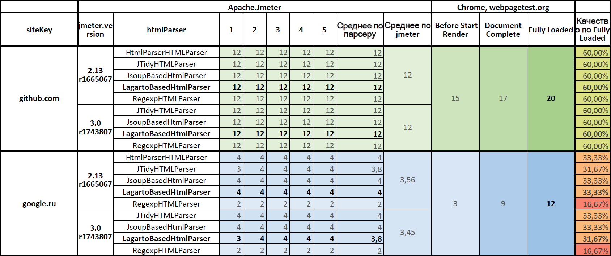
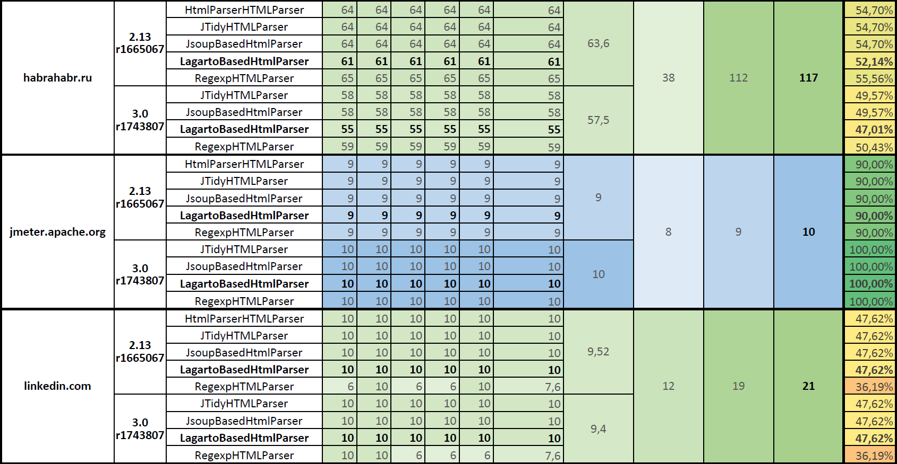
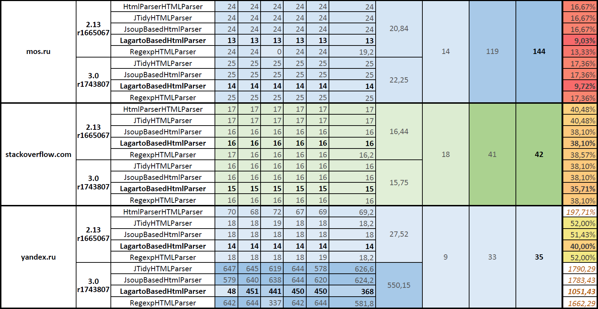

Описание столбцов:

-    **Before Start Render** — количество запросов, сделанных браузером, до момента начала отображения содержимого страницы. Это html-разметка, основные js и css-файлы, основные изображения.
-    **Document Complete** — количество запросов, сделанных браузером, на момент полной загрузки документа. Тут уже загрузились все ресурсы страницы.
-    **Fully Loaded** — количество запросов, сделанных браузером, на момент когда отработал javascript, когда загрузилось всё.

Хорошим результатом работы парсеров будет, если запросов будет столько же, сколько браузер **Google Chrome** делает на момент **Document Complete**, а отличным — на момент **Fully Loaded**. Мерилом реалистичности работы **Apache.JMeter** при использовании конкретного парсера будем считать близость количества запросов к количеству запросов, выполняемых браузером на момент **Fully Loaded**.

Если исключить результаты тестирования сайта yandex.ru, где:

-    парсинг уходит в рекурсию делая снова и снова запросы к yandex.ru пока глубина рекурсии не достигает максимального уровня и завершается ошибкой:
> `java.lang.Exception: Maximum frame/iframe nesting depth exceeded`.

и за мерило качества работы парсеров принять количество запросов на момент **Fully Loaded**, то получим такую таблицу среднего качества работы парсеров.

### Среднее качество работы парсеров

Таблица на Google Docs: [JMeter.HtmlParser.Compare (нижняя таблица)](https://docs.google.com/spreadsheets/d/16l32BFuUdrJmexTgF155HMAGW7EBaBT-rRjuuLc524c/edit?usp=sharing).

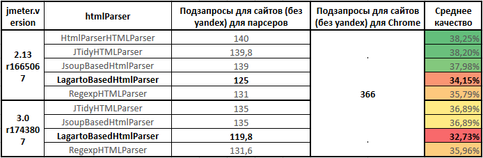

Самый точный парсер **HTMLParser** в **Apache.JMeter** 2.13. В **Apache.JMeter** 3.0 парсеры **Jsoup** и **JTidy** показали одинаковое качество. Парсер **Lagarto** отстаёт от лидеров. Полнота парсинга для парсера **Lagarto** в **Apache.JMeter** 3.0 снизилась по сравнению с **Apache.JMeter** 2.13.

Качество работы парсера **Lagarto** на актуальной версии **Apache.JMeter** 3.0 составило 32,73%, лишь треть всех подзапросов была послана, две трети нагрузки на статику не было подано.

# Логи и их обработка

## Исходные данные

Все логи доступны по ссылке: [https://drive.google.com/drive/folders/0B5nKzHDZ1RIiVkN4dDlFWDR1ZGM](https://drive.google.com/drive/folders/0B5nKzHDZ1RIiVkN4dDlFWDR1ZGM "jmeter.htmlParser.compare.logs").

### Отчёты WebPageTest.org

<table>
	<tr>
		<th>sytekey</th>
		<th>webpagetest.org</th>
		<th>Raw page data (.csv)</th>
		<th>Raw object data (.csv)</th>
		<th>HTTP Archive (.har)</th>
	</tr>
	<tr>
		<td>github.com</td>
		<td><a href="https://www.webpagetest.org/result/160819_VF_FM8/">160819_VF_FM8</a></td>
		<td><a href="https://drive.google.com/open?id=0B5nKzHDZ1RIiblRnUzNUVFM3SUk">github.com.summary.csv</a></td>
		<td><a href="https://drive.google.com/open?id=0B5nKzHDZ1RIieGFaaWFXTU9MWlE">github.com.details.csv</a></td>
		<td><a href="https://drive.google.com/open?id=0B5nKzHDZ1RIidGNQRzJYUXprVzQ">github.com.har</a></td>
	</tr>
	<tr>
		<td>google.ru</td>
		<td><a href="https://www.webpagetest.org/result/160819_C9_FQD/">160819_C9_FQD</a></td>
		<td><a href="https://drive.google.com/open?id=0B5nKzHDZ1RIiczE1OVdCaUs5Mkk">google.ru.summary.csv</a></td>
		<td><a href="https://drive.google.com/open?id=0B5nKzHDZ1RIiTUNjRk1mOHJIMEk">google.ru.details.csv</a></td>
		<td><a href="https://drive.google.com/open?id=0B5nKzHDZ1RIiYm9EejNNdHBUWnM">google.ru.har</a></td>
	</tr>
	<tr>
		<td>habrahabr.ru</td>
		<td><a href="https://www.webpagetest.org/result/160819_8N_FRB/">160819_8N_FRB</a></td>
		<td><a href="https://drive.google.com/open?id=0B5nKzHDZ1RIiM2FsMnVLLTMwb2M">habrahabr.ru.summary.csv</a></td>
		<td><a href="https://drive.google.com/open?id=0B5nKzHDZ1RIiaFZjZ2paTlUzaUE">habrahabr.ru.details.csv</a></td>
		<td><a href="https://drive.google.com/open?id=0B5nKzHDZ1RIiMG1wZkVub0NRUlU">habrahabr.ru.har</a></td>
	</tr>
	<tr>
		<td>jmeter.apache.org</td>
		<td><a href="https://www.webpagetest.org/result/160819_CG_FSM/">160819_CG_FSM</a></td>
		<td><a href="https://drive.google.com/open?id=0B5nKzHDZ1RIiVzlua0tlTnNXd28">jmeter.apache.org.summary.csv</a></td>
		<td><a href="https://drive.google.com/open?id=0B5nKzHDZ1RIieGk0TjVvZlJVd1U">jmeter.apache.org.details.csv</a></td>
		<td><a href="https://drive.google.com/open?id=0B5nKzHDZ1RIieWdLSGFOeEdZMEE">jmeter.apache.org.har</a></td>
	</tr>
	<tr>
		<td>linkedin.com</td>
		<td><a href="https://www.webpagetest.org/result/160819_K2_FY1/">160819_K2_FY1</a></td>
		<td><a href="https://drive.google.com/open?id=0B5nKzHDZ1RIiV19IMjhCUThhTVE">linkedin.com.summary.csv</a></td>
		<td><a href="https://drive.google.com/open?id=0B5nKzHDZ1RIiUmdHcWxTc1hGcVk">linkedin.com.details.csv</a></td>
		<td><a href="https://drive.google.com/open?id=0B5nKzHDZ1RIiWHVfRU1zNE84ODg">linkedin.com.har</a></td>
	</tr>
	<tr>
		<td>mos.ru</td>
		<td><a href="https://www.webpagetest.org/result/160819_91_G0F/">160819_91_G0F</a></td>
		<td><a href="https://drive.google.com/open?id=0B5nKzHDZ1RIibFJqU0hzX1IxbmM">mos.ru.summary.csv</a></td>
		<td><a href="https://drive.google.com/open?id=0B5nKzHDZ1RIibzRGNWVXNVRoQW8">mos.ru.details.csv</a></td>
		<td><a href="https://drive.google.com/open?id=0B5nKzHDZ1RIiSUczcXFSXzMzb0E">mos.ru.har</a></td>
	</tr>
	<tr>
		<td>stackoverflow.com</td>
		<td><a href="https://www.webpagetest.org/result/160819_S0_G18/">160819_S0_G18</a></td>
		<td><a href="https://drive.google.com/open?id=0B5nKzHDZ1RIidlFMbXRObkFyVzA">stackoverflow.com.summary.csv</a></td>
		<td><a href="https://drive.google.com/open?id=0B5nKzHDZ1RIiYm0wSUV4YWZzWEk">stackoverflow.com.details.csv</a></td>
		<td><a href="https://drive.google.com/open?id=0B5nKzHDZ1RIiWW1nck4tU0tvb2c">stackoverflow.com.har</a></td>
	</tr>
	<tr>
		<td>yandex.ru</td>
		<td><a href="https://www.webpagetest.org/result/160819_MR_G1R/">160819_MR_G1R</a></td>
		<td><a href="https://drive.google.com/open?id=0B5nKzHDZ1RIiUW5PSXBWMlU4Skk">yandex.ru.summary.csv</a></td>
		<td><a href="https://drive.google.com/open?id=0B5nKzHDZ1RIiWml6R3NNQ0J4bk0">yandex.ru.details.csv</a></td>
		<td><a href="https://drive.google.com/open?id=0B5nKzHDZ1RIiQTNkaWFFN0NhOFU">yandex.ru.har</a></td>
	</tr>
</table>

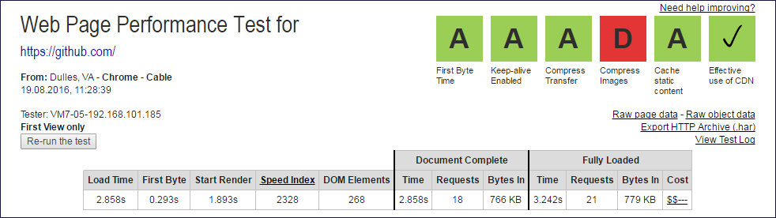
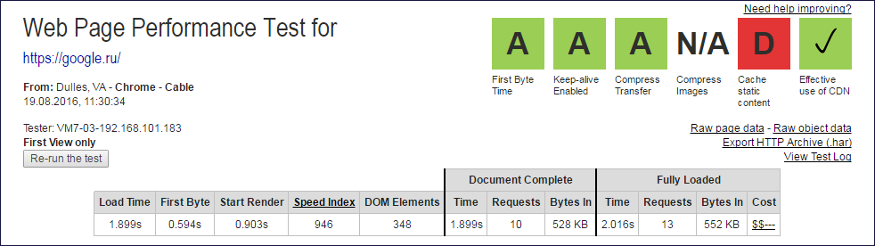
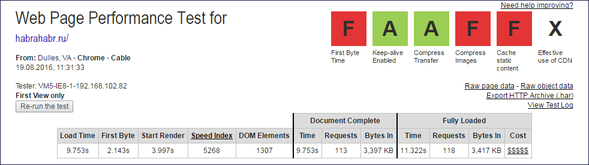
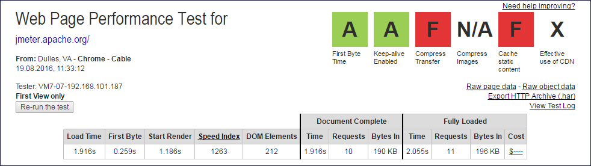
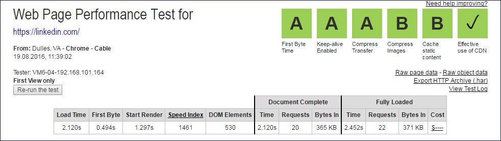
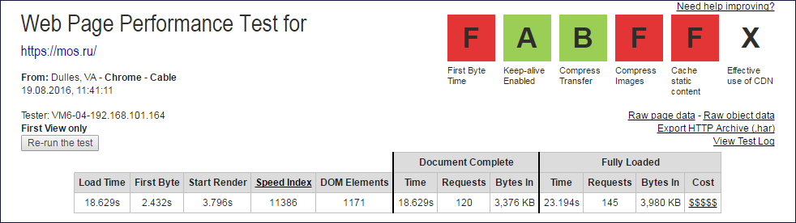
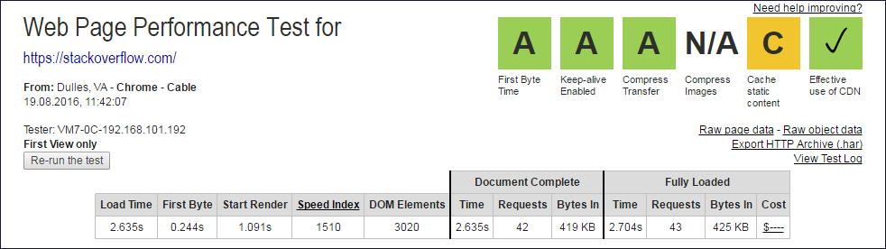
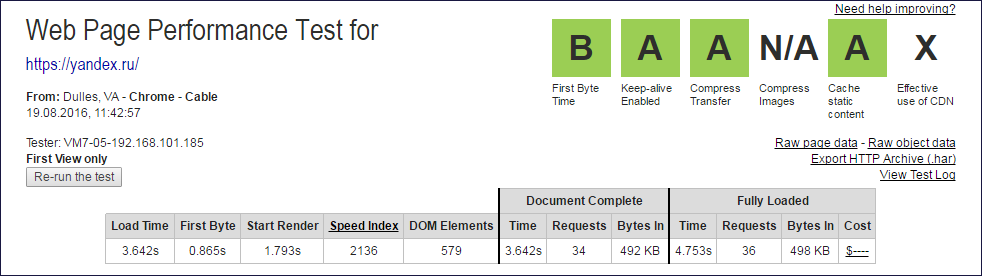

### Логи Apache.JMeter

Для обработки используются csv-логи, сформированные плагином **CsvLogWriter**:

- описание: [https://habrahabr.ru/post/308098/](https://habrahabr.ru/post/308098/ "Плагин CsvLogWriter для JMeter ");
- проект: [https://github.com/pflb/Jmeter.Plugin.CsvLogWriter](https://github.com/pflb/Jmeter.Plugin.CsvLogWriter "Jmeter.Plugin.CsvLogWriter").

В результате работы которого формируется лог, в список колонок которого входят:

- ***timeStamp*** — момент времени;
- ***URL*** — адрес запроса;
- ***elapsed*** — длительность получения ответа на запрос;
- ***bytes*** — размер ответа;
- ***siteKey*** — используемый сайт;
- ***htmlParser*** — название используемого ;
- ***jmeterVersion*** — используемая версия Apache.JMeter;
- ***i*** — номер итерации тестирования.

Аггрегация csv-логов **Apache.JMeter** выполняется при помощь **pandas** вот таким кодом на **python**:

	import pandas as pd
	import codecs
	from os import listdir
	import numpy as np
	
	
	# Настройки - каталог с логами и настройки считывания логов.
	dirPath = "D:/project/jmeter.htmlParser.3.0.vs.2.13/logs"
	
	read_csv_param = dict( index_col=['timeStamp'],
	                       low_memory=False,
	                       sep = ";",
	                       na_values=[' ','','null'])
	
	# Получение списка csv-файлов в каталоге с логами.
	files = filter(lambda a: '.csv' in a, listdir(dirPath))
	
	
	# Чтение содержимого всех csv-файлов в DataFrame dfs.
	csvfile = dirPath + "/" + files[0]
	print(files[0])
	dfs = pd.read_csv(csvfile,**read_csv_param)
	for csvfile in files[1:]:
	    print(csvfile)
	    tempDfs = pd.read_csv(dirPath + "/" + csvfile, **read_csv_param)
	    dfs = dfs.append(tempDfs)
	
	#dfs.to_excel(dirPath + "/total.xlsx")
	
	# Убрать из выборки все JSR223, по ним статистику строить не надо, оставить только HTTP Request Sampler.
	# У JSR223 URL пустой, у HTTP-запросов URL указан.
	dfs = dfs[(pd.isnull(dfs.URL) == False)]
	
	
	# Сводная таблица по количеству подзапросов, сохраняется в report.subrequests.html - основной результат работы.
	# Из количества запросов удаляется один запрос, чтобы исключить корневой запрос.
	# Цель данного исследования - подсчёт количества подзапросов, поэтому корневой исключается.
	pd.pivot_table(dfs, 
	               index=['siteKey', "jmeterVersion", "htmlParser"], 
	               values="URL", 
	               columns=["i"], 
	               aggfunc=lambda url: url.count()-1).to_html(dirPath + "/report.subrequest.count.html")

# Рекурсивная загрузка на yandex.ru

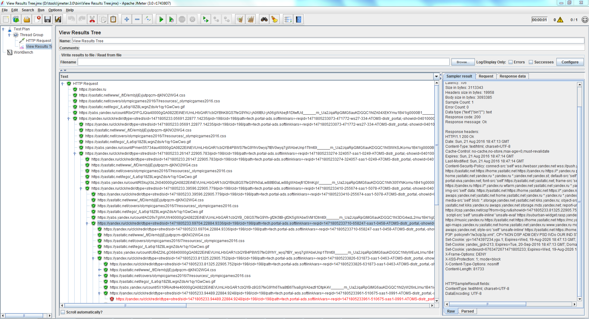

Как видно:

1. Apache.JMeter находит и переходит по ссылке `https://yandex.ru/clck/redir/dtype=stred....7004fcb3793e79bb1ac9e&keyno=12`
2. Затем находит новую уникальную ссылку `https://yandex.ru/clck/redir/dtype=stred....cd1c46cad58fbfe2f61&keyno=12`
3. И так уходит в рекурсию.

В данном случае это картинка внутри ссылки на загрузку Яндекс Браузера:

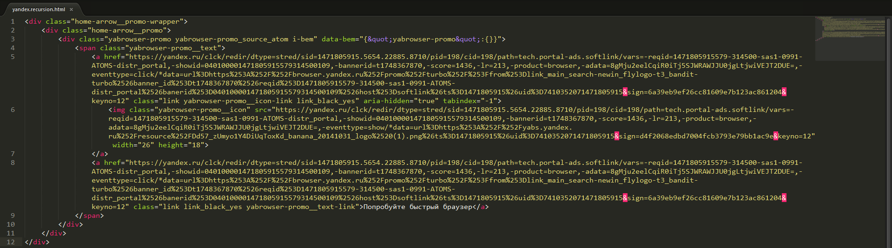

И эту картинку парсер находит. JMeter пробует её скачать, в ответ получает html-страницу, там снова ссылка на картинку и другие ссылки. Поведение **Apache.JMeter** корректное.

А в **Apache.JMeter** 2.13 либо:
-  есть ограничение на длину ссылок, и за счёт отсекания уникального окончания ссылки рекурсии не происходит;
-  или в **Apache.JMeter** 2.13, что-то неправильно работает в парсерах;
-  или в **Apache.JMeter** 2.13, что-то работает наоборот правильно - куки, ещё что-то и сам сервер Яндекса отвечает ему так, чтобы тот не уходил в рекурсию, например, отвечает картинкой на запрос картинки, а не новой html-страницей.

Гадать не буду. Кажется безвыходная ситуация. Но таких ситуаций не бывает. Всегда есть решение.

Например, можно попробовать в качестве **User-Agent** указать Яндекс Браузер. Тогда сервер, наверно, не покажет картинку для скачивания браузера, или на запрос картинки будет отвечать картинкой, и рекурсии не будет. Это догадка, не проверял её.

Сейчас в скрипте был указан **User-Agent** для Google Chrome для синхронности с работой webpagetest.org, и сервер видя не свой браузер, видимо, предлагает ссылку на свой.

# Состав проекта

- **jmeter.testfile.jmx** — тестовый скрипт для **Apache.JMeter 2.13** и **Apache.JMeter 3.0** принимающий на вход параметры:
  - `URL` — адрес тестируемого сайта, например, https://yandex.ru/;
  - `siteKey` — строка по которой будет осуществляться группировка записей в логах, например, yandex.ru;
  - `loopCount` — количество итераций теста, используется несколько итераций из-за того, что работа веб-сайтов может быть нестабильной;
  - `htmlParser.className` — парсер для извлечения ссылок на встроенные ресурсы;
  - для работы скрипта необходимо скачать и установить дополнительный плагин [CsvLogWriter](https://github.com/pflb/Jmeter.Plugin.CsvLogWriter/releases).
- **jmeter.3.0.bat** — командный файл запуска теста для **Apache.JMeter 3.0**, тут задаётся путь к папке `/bin/` **Apache.JMeter 3.0**, путь к тестовому скрипту **jmeter.testfile.jmx**, опции запуска теста, а также список htmlParser-ов проверка работы которых выполняется;
- **jmeter.2.13.bat** — командный файл запуска теста для **Apache.JMeter 2.13**, тут задаётся путь к папке `/bin/` **Apache.JMeter 2.13**, путь к тестовому скрипту **jmeter.testfile.jmx**, опции запуска теста, а также список htmlParser-ов проверка работы которых выполняется;
- **test.bat** — командный файл запуска теста на двух версиях **Apache.JMeter**, 2.13 и 3.0, файл содержит количество итераций тестирования и адреса тестируемых сайтов. Файл вызывает файлы **jmeter.2.13.bat** и **jmeter.3.0.bat**;
- **jmeter.3.0.vs.jmeter.2.13.ipynb** — блокнот для **jupyter** для анализа логов работы **Apache.JMeter**;
- **statistics.xlsx** — таблица со статистикой по работе парсеров, результат исследования.

# Выводы

Особой практической ценности в статье нет. Но некоторые полезные выводы сделать можно:

- парсер в среднем извлекает ссылки только на треть ресурсов;
- парсеры работают почти одинаково, а значит можно применять любой;
- парсеры заточены под работу с простыми сайтами, такими как jmeter.apache.org;
- на сайтах с большим количеством содержимого парсеры работают значительно хуже реального браузера;
- полнота загрузки встроенных ресурсов в новой версии JMeter незначительно снизилась, а не возросла;
- продемонстрировано прикладное использование плагина **CsvLogWriter** (см. статью [Плагин CsvLogWriter для JMeter](https://habrahabr.ru/post/308098/)),  логирующего запросы к embedded-ресурсам в csv-лог, который сделала моя коллега Александра @Sanchez92;
- с помощью bat-файлов, передачи парамеров **JMeter** через командную строку, логирования переменных и обработки csv-логов с помощью **pandas** можно тестировать сам инструмент тестирования; методика отработана.